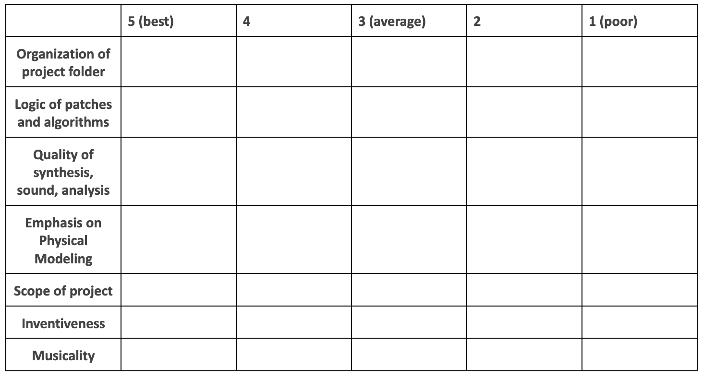

---
# Feel free to add content and custom Front Matter to this file.
# To modify the layout, see https://jekyllrb.com/docs/themes/#overriding-theme-defaults

# layout: archive   
layout: single   
title: "Final Exam: Mixed Piece with Max Patch"   
lang: en   
ref: grade  
permalink: /final-mixed-piece/   
toc: true  
toc_label: "Grading Contents" # default: Content
toc_icon: "graduation-cap"  # corr esponding Font Awesome icon name without the "fa" prefix
toc_sticky: true   # enables sticky toc  
read_time: true  
date: 2023-08-01  
last_modified_at: 2023-08-28  

---

### Deadline: Week 13: {{ site.week-13 }}  

### I. Overview   

The final exam is a presentation of a creative project realied in MaxMSP that is self-directed throughout the semester, with occasional "check-in points" where I evaluate your progress. For example, our Midterm Exam is one such potential "check-in point." Your project may be conceived as a _work in progress_ but **must be presented as a finished draft of a composition** whose performance will be featured during the _**Werkstatt für Aktuelle Musik**_ (January 17-20, 2024). 

The piece and its performance count as your final exam grade for the purpose of this class: **A work that is incomplete or that does not receive a performance will fail the exam**.    

Your piece should generally make use of the tools explored this semester that best serve your creative goals. Your project is an opportunity to engage directly with your own strengths, skills, aesthetic questions, and lines of artistic inquiry.  

Your piece may evolve naturally as an extension of the work you completed for our Midterm Exam “sketch.” You are encouraged (but not required) to use your Midterm “sketch” as a basis for your final exam. You can also use our Final Exam piece as an opportunity to develop a mixed piece for any other recital or commission obligation at MHL or elsewhere, but it must still meet the requirements of the exam detailed below. Of course, you can choose to treat the final as an entirely separate piece, but the option to use your Midterm as a “miniature” is given.      

<!-- The final is a complete piece (_recommended: 8-12 minutes in duration_) for fixed media, in 8-channel surround sound. 

This piece will be featured during the _**Werkstatt für Aktuelle Musik**_ (January 17-20, 2024).  

You are encouraged (but not required) to use your midterm “sketch” as a basis for your final piece.  

It would be an efficient use of time to expand upon the ideas you presented in your midterm, or somehow make use of the work you did there. Supplement this new mixing, multichannel, and MaxMSP techniques that you continued to learn since Week 6. Revise automation or record new sounds, etc.  

By the deadline, send me a Reaper project folder (by email, WeTransfer.com, or any cloud link), and a stereo mixdown (binaural), meeting the following criteria:   -->

### II. Procedure / General Timeline   

1. If you’re unsure how to get started, one method is to **begin with the sound(s) you’re most drawn to**; develop a plan that freely explores how to create and transform the sounds that most fascinate you. Your project will take shape as you venture forward.  
2. Your piece should be a work that **includes a live performer (or a small number of performers)** with electronically-produced sounds, structured in a Max concert patch. You must consult, collaborate with, and rehearse your performer(s) in preparation for your performances in January. It is best to use this project as an opportunity to communicate and collaborate with another artist. You, as the composer, will also be responsible for controlling your Max patch at the mixing console while another musicians performs your piece on stage. You may perform on another classmate’s composition, but not on your own. You can also have your performer trigger events with a pedal. _It is highly recommended that you consider and approach performers early so that you don't get far behind. Pieces for 1 or 2 players are recommended, but more parts will pose more challenges. Pieces involving more than 4 parts will require special approval from the instructor._     
3. An improvisational performance environment is certainly possible, but you must also include a PDF **score** that aims to notate general performance activity alongisde a cueing system that synchronizes your Max patch, so be sure to budget time notating your ideas in some way.     
2. **Your project and its materials may change** as you begin working and as we explore new topics each week. Allow yourself the flexibility to adapt and change direction, and to include new tools as we learn them.  
3. Reach out to the instructor at any point for support, guidance, clarification, or with any questions that might arise.  
4. By the deadline, **submit your folder of patches, sound files, and everything necessary to run it on another computer**. To best prepare for this, load your project on another computer or a classmate’s computer — as you initialize your patch, check the console for error messages indicating any missing components. 

### III. Things Your Project Should Have   

1. A **folder** of patches, abstractions, sounds, and other dependencies, ideally [a Max “package.”](https://docs.cycling74.com/max8/vignettes/packages?q=packages){:target="_blank"}  
2. A clearly labeled **main patch**, which serves as your central interface and loads other sub-patches.  
3. An **initialization** routine that sets your piece's opening parameters, readying everything before your patch produces its first sound or event number.  
4. An **input and output patch**: steal these from the versions we created earlier in the semester!  
5. A **“script” (or cueing system)** for individual events and transitions.  
6. Your project should draw on a **combination** of sound sources, synthesis processes, and/or treatments of your choosing, and its performance interface should be designed with your sounds, your own preferences, parameters, and formal procedures.    
7. Your project should in some way **respond to the various tools and aesthetic approaches we learned in class**, even if it is positioned as a strong departure from these older forms. Recall our lessons on micromontage, granulation, musique concrète, sampling, field recording, serial and other historic formalisms, etc. How is your work related (or not) to these paradigms?  
8. If you choose to use **multichannel spatialization**, kindly note that on this concert, we are **limited to an 8-channel ring**. While your multichannel `spat~` scene may have more inputs than this, but should not exceed this output configuration.  
9. Strive for **tonal balance in your sounds**. For example, use **EQ** and **compression** to improve the interaction between overlapping sounds or layers, with special attention to how the sounds change when you include multichannel spatial movement.  
10. Sound files and samples should be exported at our standard **sample rate of 48 kHz** and a **bit depth of 24 bits** (48 kHz / 24 bits).  
11. A **score** for your piece that _includes event numbers_ to be executed in your patch alongside your performer's written line. It is best practice to include a PDF copy of your score in your project folder.  
12. A **tech rider** that satisfies the requirements of [MHL Digitale Kreation's Tech Rider Template](#){:target="_blank"}. Use the tempalate provided in class and through our periodically offered Tech Rider Workshops. The more detail, the better.     

### Concert Patch with Live Performer(s)   

Your performance patch serves to accompany a live musician (or musicans) as part of a **concert work with electronics**. Although this may be most appropriate for those composing and conceiving musical time _linearly_ (that is, if you’re accustomed to planning the general moment-to-moment succession of  musical ideas and sounds), you are **highly encouraged to explore _non-linear_ approaches** — allowing the classical performer or improvsior,  audience, or even a real-time data analysis stream to somehow influence or change the course of the piece. Despite its name, this option can employ any number of real-time tools.  

If you have an idea for a project outside of this description listed above, you may develop an alternative project **as long as it is approved in advance by the instructor**. If you choose this option, submit a description of your ideas anytime before Week 4: simply email me with a 2-4 paragraph summary of your ideas and plans. I will be in touch to discuss options and to proceed.  

### Problematic Elements   

In general most everything is permissible, but there are a few ground rules. Avoid these:   

* **Signal processing of music or audio that is not your own**. All source materials should belong to you; _your_ patches and _your_ recordings. As much as I love mashup artists, this is unfortunately not the right setting for using identifiable excerpts of someone else’s music. The use of “found” sound materials is not the same thing as the use of fully-produced recordings for which you do not have copyright secured, so please avoid this. 
* **Patches in which sound is produced only from a single source**. We explored this approach to signal processing early in the semester for pedagogical purposes, but by the end of the term it is your job to use our various tools as building blocks for some larger structure. Monosynths are also problematic in this way. If you are exploring the gradual transformation of a sound, these procedures need to unfold in some way that makes use of multiple tools and perceivable changes over time. 
* **Overemphasis on pop music production norms at the expense of our synthesis goals**. While I don’t mind if your final composition utilizes a typical pop music instrumentation or includes a beat, music that adheres only to song form based on typical chorus/refrain, or which overemphasizes vocals, does not make sufficient use of our synthesis tools, or does not address or respond to the aesthetic questions studied in our class, will not be considered sufficient in scope. This class is an opportunity to deepen your understanding of more subtle and abstract musical relationships. If you normally write songs, use this project to compose something you’ve never composed before, like a granular piece, which will enrich your compositional and listening skills. A creative departure from basal songwriting is expected and will be graded closely.  
* **Use of software we did not learn in class**. All of your materials should stem from our lessons in MaxMSP and bach, using your own field recordings or samples, and any other tools explored in class. The use of other software tools and external sample libraries is strictly prohibited. Pending access to room 324, you may opt to record your own sounds on our MHL modular synthesizers, but you may not sample other software instruments or synthesizers.  

### Rubric  

Details in the boxes below will be filled in upon grading and provided as feedback at the end of the semester. Each of the grading components below will be weighed against the others for a complete project grade.  

  

If you have any questions, please don't hesitate to reach out to me and ask.  

_I'm looking forward to seeing your pieces come to life!_  

* * *    
 
<!-- ### Criteria   

The final exam piece should address similar criteria from the midterm exam, and additionally:   

* Ideally, your sketch is around **8-12 minutes in duration**, but of course, this **may vary** depending on your material and your compositional approach and the timing needs of the final concert. It can be a longer excerpt, but not much shorter.  
* Prepare your sketch **in a Reaper session**. Any sound files you use should also be contained inside your Reaper project folder.  
* Sketches should be your own, original work, focusing on your manipulation of the source sounds that interest you.  
* Include **at least 2 source sound files** and/or synthesis clips.  
* Your Reaper project should include a sequence that **utilizes multiple tracks** (recommended: 8).  
* Your Reaper tracks should include **automation**.  
* Make extensive use of SpatGRIS: add ControlGRIS to your tracks and add automation to in order to move your sounds around the space.  
* The 8-channel space is conceived of as a **ring of 8**, meaning 8 equidistantly-spaced speakers surrounding the audience.  
* These tracks may include any number of **plugin** devices.  
* If you use plugins, include a **list** of them: _Your mix must be transferrable and able to play on another computer._  
* Strive for **tonal balance in your mix**. For example, use **EQ** and **compression** to improve the interaction between the sounds in your tracks, with special attention to how the sounds change when you apply multichannel spatial movement.   
* Sound files and samples should be exported at a **sample rate of 48 kHz** and a **bit rate of 24 bits** (48 kHz / 24 bits).   

_Note that you're being given the **maximum amount of time to finish your pieces** before they are presented on the concert. Therefore, if your piece is late, unfortunately this will result in a fail._   

_Once the piece has been soundchecked on the performance day, no further revisions or changes can be made before the performance._  
 -->
