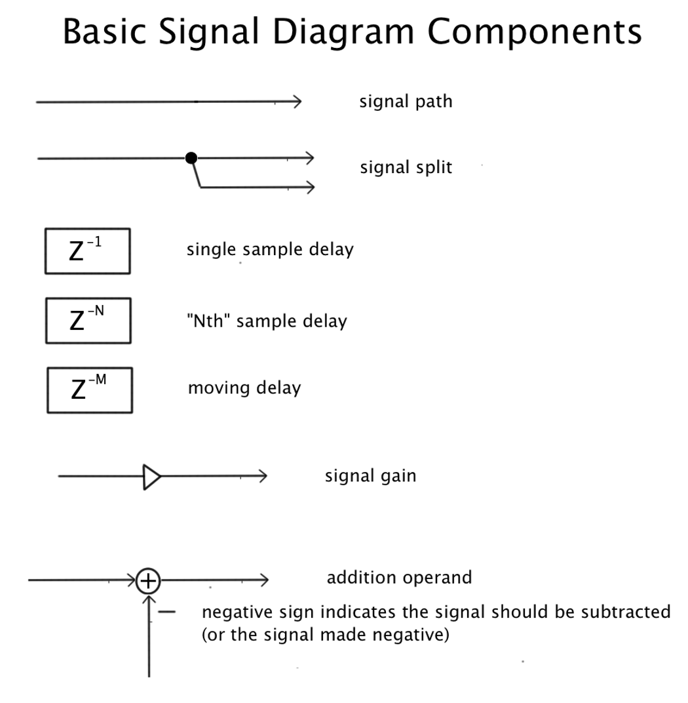

---
# Feel free to add content and custom Front Matter to this file.
# To modify the layout, see https://jekyllrb.com/docs/themes/#overriding-theme-defaults

# layout: archive
layout: single   
title: Schedule   
lang: en   
ref: sched   
permalink: /schedule/   
# sidebar:
#   nav: "schedule-toc"   
toc: true  
toc_label: "Schedule" # default: Content
toc_icon: "bell"  # corr esponding Font Awesome icon name without the "fa" prefix
toc_sticky: true   # enables sticky toc 
read_time: true  
date: 2024-03-20   
last_modified_at: 2024-03-20   

---

<link rel="stylesheet" href="https://cdn.jsdelivr.net/gh/lipis/flag-icons@6.11.0/css/flag-icons.min.css"/>

  
  
    <li class="zoom"><a href="{{ page.url }}" class="{{ page.lang }}"></a></li>
  

  <i class="fas fa-bell fa-2x"></i>

<!--  -->

<!-- # Schedule -->
_This page will be updated frequently with examples, video tutorials, links to new resources, and occasional updates to LAB ASSIGNMENTS. Our schedule follows the [Current MHL Academic Calendar]({{ site.MHL-calendar }}){:target="_blank"}. The following topics and their precise order may change. Check here for updates!_  

* * *

## Week 1: {{ site.week-01 }}  
### {{ site.week-01-topic }}    

#### Start-of-Semester Business  

* Review [Syllabus + course policies.](/MHL-Physical-Modeling/index.html){:target="_blank"}  
* Review [Software Installation.](/MHL-Physical-Modeling/resources/){:target="_blank"}   
<!-- * Review [Detailed Breakdown of Grading.](/MHL-Physical-Modeling/grading/){:target="_blank"}   -->

#### Listening     
* [Example of a metal beam structure excited by plucking forces (using the mi-gen~ package)](https://youtu.be/jgzVsZeTNGo?si=31ylLUjj55pTOVwO){:target="_blank"}     

   

* [Marco Stroppa, _Come Play with Me_, VI. Strike)](https://youtu.be/DFWmCVs5GV0?si=r6_2FyZTtQ6yGL80){:target="_blank"}     

   

#### Tutorials     
* [What is Physical Modeling Synthesis?](https://www.perfectcircuit.com/signal/what-is-physical-modeling){:target="_blank"}    
* Prof. Jon Nelson Physical Modeling slides:   
<iframe src="https://docs.google.com/presentation/d/e/2PACX-1vSdN_FURnfLtRS0CMMsSkrHPWrZcsKUXj7wFuXP2GdzBQQlqfOfVGgMFyYYdXSjnQ/embed?start=false&loop=false&delayms=3000" frameborder="0" width="624" height="486" allowfullscreen="true" mozallowfullscreen="true" webkitallowfullscreen="true"></iframe>   

* [Demystyfying Digital Filters (reference)](https://cycling74-web-uploads.s3.amazonaws.com/57ec430afd747b8a71b4f1ab/2021-03-26T22:03:16Z/demystifying-digital-filters.pdf){:target="_blank"}  
* [Basic Signal Diagram Components](assets/images/basic.signal.diagram.components.png){:target="_blank"}    

<!--    -->

#### Downloads  
<!-- * [Interacting With `bach.roll` boiler patches](https://github.com/einbahnstrasse/interacting-with-bach-roll){:target="_blank"}      -->

#### Assignments _(always due before the next class!)_   
* Install + Authorize MaxMSP    
* Install the CNMAT Externals package (_Search for_ `CNMAT Externals` _in Package Manager. See instructions for using the Max Package Manager on our Software + Resources page_.)   
* [Filter Characteristics (Digital Filter Basics)](https://youtu.be/autPNZ9XMa4?si=1FTZB6r6q1NZ5ymU){:target="_blank"}         

    
* [Test Signals (Digital Filter Basics)](https://youtu.be/ItYpQ7hMupQ?si=6lK6s9uRPHI5T4Ck){:target="_blank"}         

    

* * *

## Week 2: {{ site.week-02 }}  
### {{ site.week-02-topic }}    

#### Tutorials    

#### Mechanical Resonance    
_Watch just a few moments of these examples._   
* [Tacoma Narrows Bridge Collapse (1940)](https://youtu.be/j-zczJXSxnw?si=xmXJD0aquZbH-n8-&t=8){:target="_blank"}      

    

* [Pogo Oscillations on the Apollo 6 Rocket (1967)](https://youtu.be/pOOrXWLLza0?si=Yl2PoY3VLfGfxG8A&t=14){:target="_blank"}      

    

#### Downloads   
<!-- * [Bach and `poly~` boiler patches](https://github.com/einbahnstrasse/bach-poly-boiler-patches/){:target="_blank"}      -->

#### Listening   

#### Assignments   
<!-- * Assign + discuss the [Microphone Cable Coiling](https://einbahnstrasse.github.io/MHL-Physical-Modeling/xlr-cable-coiling/){:target="_blank"} Assignment.   -->
<!-- * Assign & disucss [Final Exam: Mixed Piece with Max Patch](/MHL-Physical-Modeling/final-mixed-piece/){:target="_blank"}   
* Consider the [score for _**Giffen Good**_ (2014) for Trombone and Live Electronics](https://drive.google.com/file/d/0BwEuqJNr_Pm2SVhTNlZwdWRMSDQ/view?usp=sharing&resourcekey=0-VGg0No-RZ5esl5DVr_0Ygg){:target="_blank"} — as an example approach to using Bach for **generative notation** in a piece of **mixed music**         -->
* [Feedforward Filter (Digital Filter Basics)](https://youtu.be/ffVcEvYvtcQ?si=_ChokCMOvwgirz4f){:target="_blank"}       

    

* [FIR: Finite Impulse Response Filters (Digital Filter Basics)](https://youtu.be/_WoqwSBkhj0?si=Nv6X9APyvN2TFK96){:target="_blank"}         

    

* * *

## Week 3: {{ site.week-03 }}  
### {{ site.week-03-topic }}    

#### Tutorials   

#### Listening   

#### Assignments   
* [Feedback Filter (Digital Filter Basics)](https://youtu.be/NC_dAcvYLsc?si=8KZ38cZTjPHXmMcq){:target="_blank"}       

    

* [IIR: Infinite Impulse Response Filters (Digital Filter Basics)](https://youtu.be/ap1qXBTKU8g?si=v2Y2SJhsltlTc5La){:target="_blank"}         

    

* * *  

## Week 4: {{ site.week-04 }}  
### {{ site.week-04-topic }}    

#### Assignments   

* * *  

## Week 5: {{ site.week-05 }}  
### {{ site.week-05-topic }}    

#### Tutorials    
* scattering junctions   

#### Downloads  

#### Listening   

#### Assignments   
  
* * *   

## Week 6: {{ site.week-06 }}  
### {{ site.week-06-topic }}    

<!-- #### Tutorials   -->

#### Assignments  
<!-- * <em>Deadline to send + receive XLR Cable Coiling videos.</em>   -->

* * *

## Week 7: {{ site.week-07 }}  
### {{ site.week-07-topic }}    

#### Tutorials    

#### Listening   
  
* * *

## Week 8: {{ site.week-08 }}  
### {{ site.week-08-topic }}    

#### Tutorials  
* [Basic Concepts of Synthesis with Modalys](https://support.ircam.fr/docs/Modalys/current/Introduction.html#basic-concepts-of-synthesis-with-modalys){:target="_blank"}         

#### Assignments      

* * *

## Week 9: {{ site.week-09 }}  
### {{ site.week-09-topic }}    

#### Tutorials    

#### Assignments   

* * *

## Week 10: {{ site.week-10 }}  
### {{ site.week-10-topic }}    

#### Definitions  
  
#### Tutorials  

#### Downloads   

#### Assignments   

* * *

## Week 11: {{ site.week-11 }}  
### {{ site.week-11-topic }}    

### Tutorials 

### Assignments   
  

* * *

## Week 12: {{ site.week-12 }}   
### {{ site.week-12-topic }}    

#### Tutorials  
* [3D Finite Elements in Modalys](https://support.ircam.fr/docs/Modalys/current/Finite_Elements.html){:target="_blank"}    
* Finite Elements in ModaLisp   
* Finite Elements using the `mlys.lua` controller    

#### Listening   

#### Assignments   

* * *

## Week 13: {{ site.week-13 }}  
### {{ site.week-13-topic }}    

#### Tutorials  

#### Assignments   

* * *

## Week 14: {{ site.week-14 }}  
### {{ site.week-14-topic }}    

### Listening   
   
### Assignments  

* * *

## Week 15: {{ site.week-15 }}   
### {{ site.week-15-topic }}    

#### Tutorials   

### Listening   

#### Assignments  

* * *

